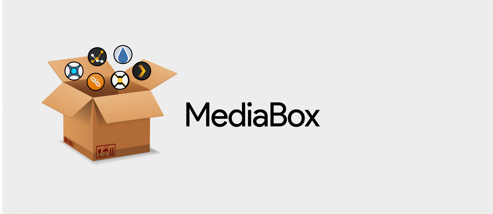

# MediaBox

# About
  MediaBox is a Docker-Compose file consiting of all the relevant componenets to setup your own Media Server.

## Includes
* Plex
* Sonarr
* Radarr
* Deluge
* Ombi
* Tautulli
* Cardigann
* TV Headend
* Channels DVR

## Requirements
* Docker
* Docker-Compose

## Instructions
* Set Environment Variables
  * 
* Clone Repo to ~/docker
* Change to MediaBox directory
* docker-compose up -d docker-compose.yml
